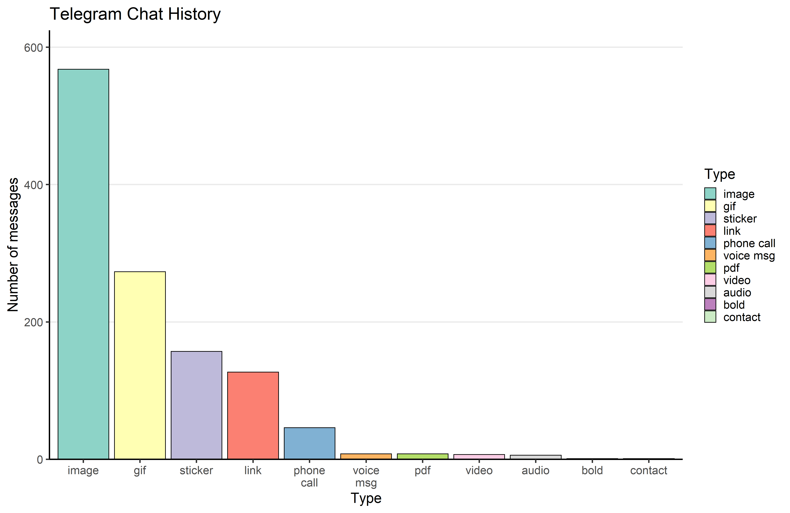
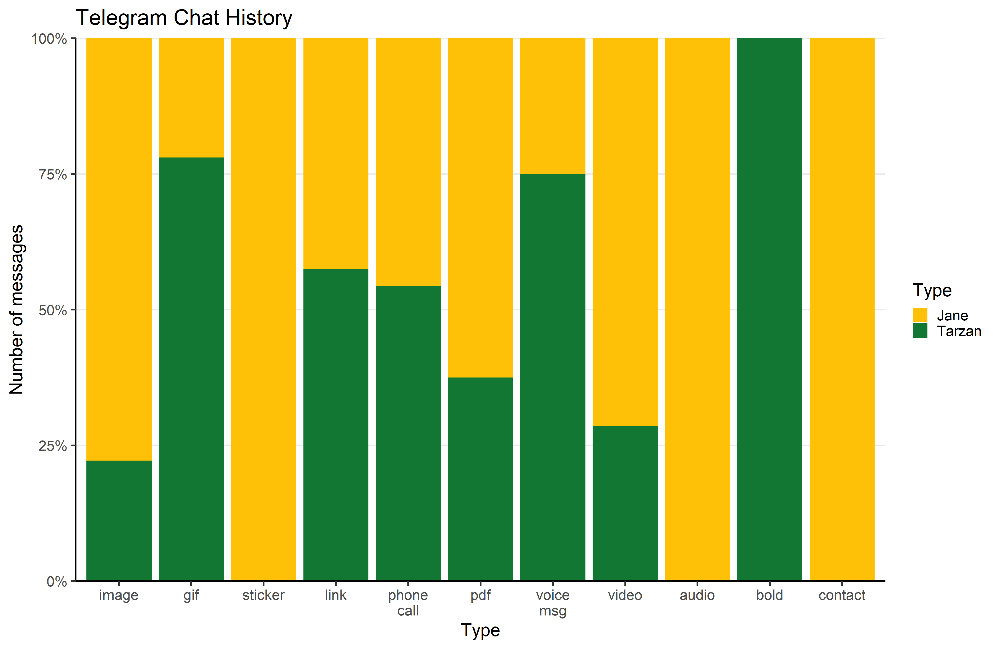
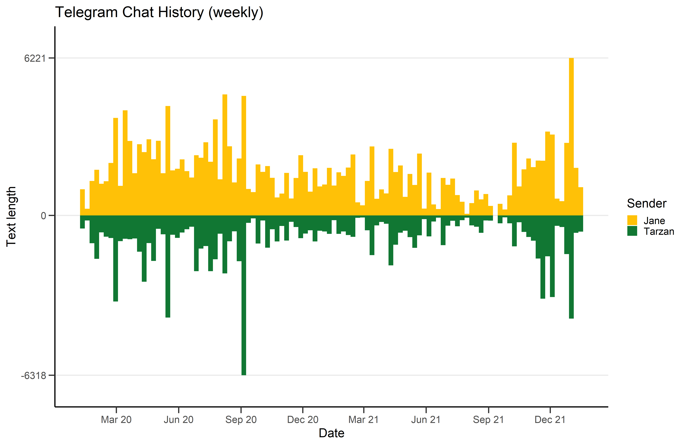
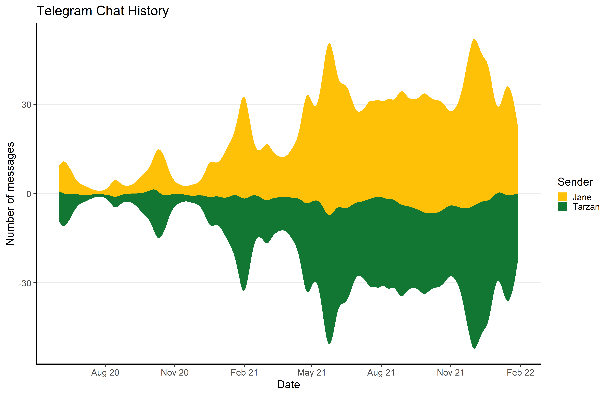
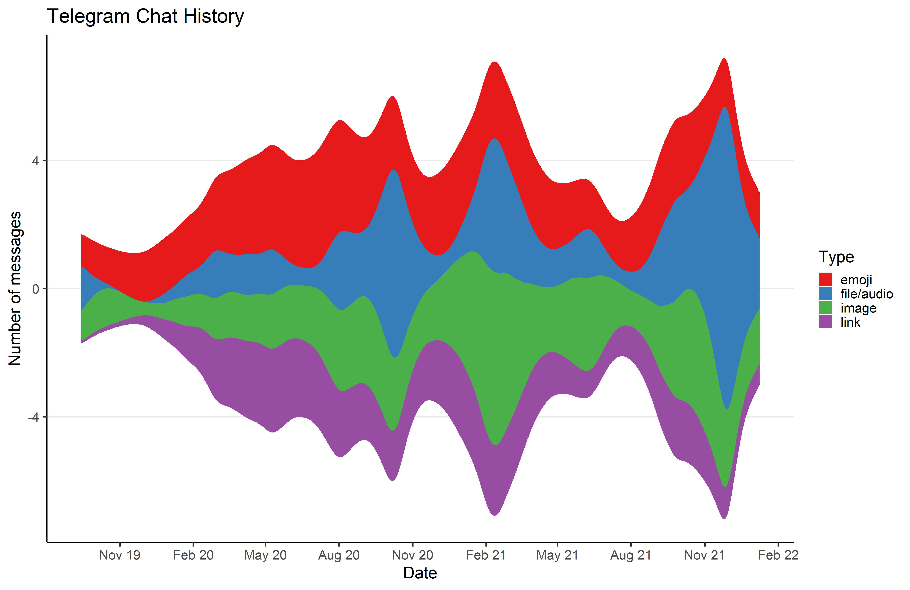

# ChatStatistics
A small project to visualize your chat habits (frequency, text lengths, content) using R and ggplot.

## Telegram
The evaluation_telegram.R script can easily be personalized by setting names, color, timeline spacing etc. at the top of the file. If there are long breaks in your communication, try setting agg_unit to "week" instead of "day" and use length_table_weekly in line number 406.

The following visualizations are supported:

- text length daily/weekly by person as barplot/stream
- number of messages daily/weekly by person as barplot/stream
- exact type of messages by person/overall as barplot
- low level type of messages as stream

  
  

  
  

  

## Discord
coming soon
